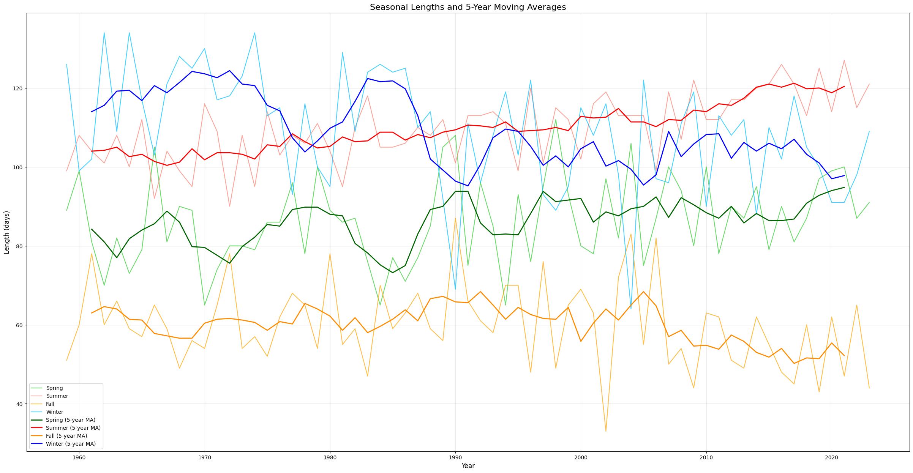
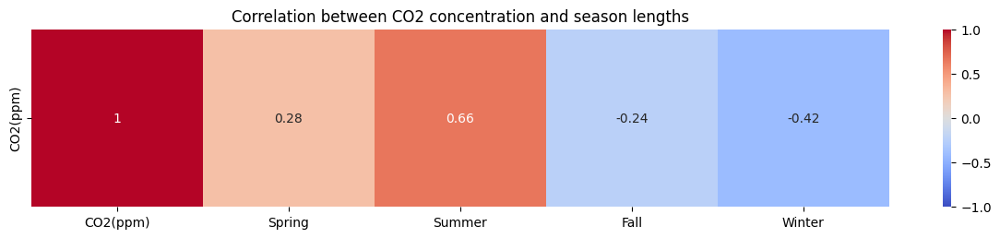
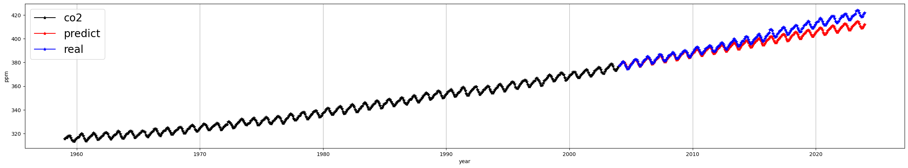
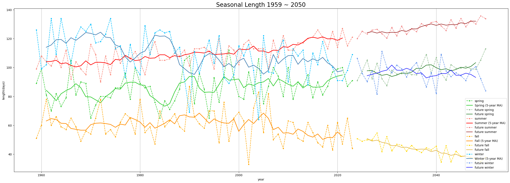
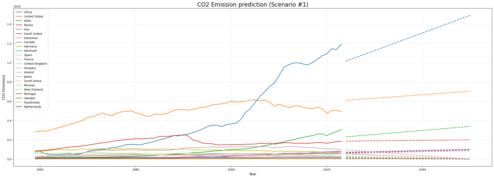
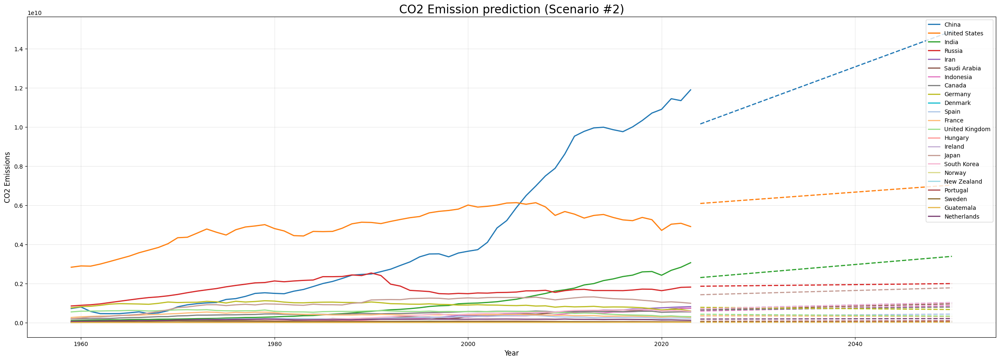
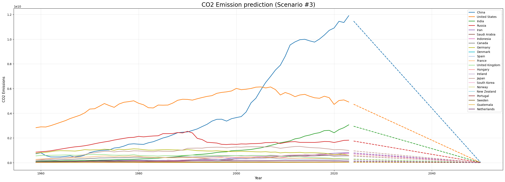
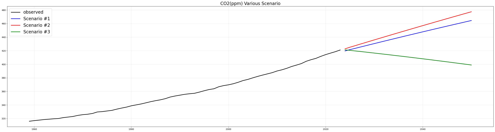
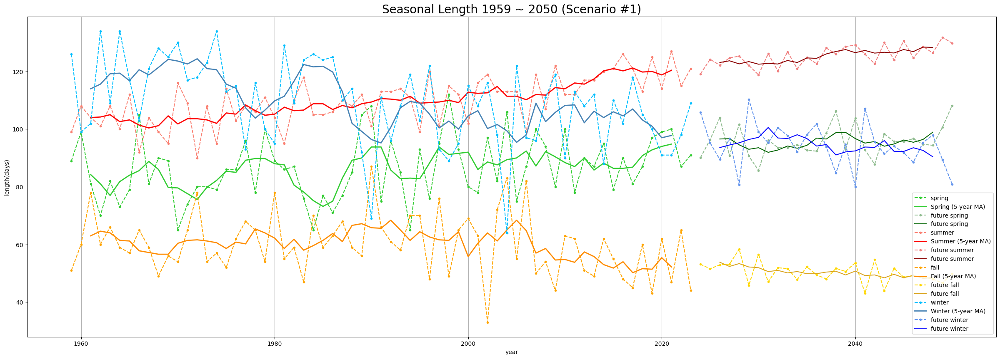
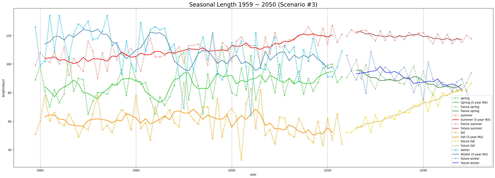

# 🎓 빅데이터 입문 Term 프로젝트

**주제**: 탄소중립 시나리오에 따른 이산화탄소 농도 변화와 계절 길이 예측

---

## 1. 프로젝트 개요

본 프로젝트는 이산화탄소 농도와 대한민국의 계절 길이 변화 간의 관계를 분석하고, 이를 바탕으로 미래 계절 길이를 예측합니다. 실험은 다음 단계를 통해 진행되었습니다:

1. **CO2 배출량 예측**:  
   𝑪𝑶𝟐*𝒆𝒎𝒊𝒔𝒔𝒊𝒐𝒏𝒔(2024~2050) = 𝐿𝑖𝑛𝑒𝑎𝑟𝑅𝑒𝑔𝑟𝑒𝑠𝑠𝑖𝑜𝑛(𝐶𝑂2*𝑒𝑚𝑖𝑠𝑠𝑖𝑜𝑛𝑠(1959~2023))

2. **CO2 농도 예측**:  
   𝑪𝑶𝟐*𝒑𝒑𝒎(2024~2050) = 𝑆𝐴𝑅𝐼𝑀𝐴𝑋(𝑪𝑶𝟐*𝒆𝒎𝒊𝒔𝒔𝒊𝒐𝒏𝒔(2024~2050))

3. **미래 계절 길이 예측**:  
   𝑆𝑒𝑎𝑠𝑜𝑛(2024~2050) = 𝑆𝐴𝑅𝐼𝑀𝐴𝑋(𝑪𝑶𝟐_𝒑𝒑𝒎(2024~2050))

---

## 2. 사계절 길이 데이터 제작

- 기상학적 계절 길이를 정의하여 데이터 제작:
  - **여름**: 일평균 기온의 9일 이동 평균이 20°C 이상으로 상승한 후 다시 떨어지지 않는 첫 날
  - **봄**: 5°C 이상
  - **가을**: 20°C 미만
  - **겨울**: 5°C 미만

---

## 3. 이산화탄소 농도와 계절 길이의 상관관계

- **봄, 여름**: CO2 농도와 양의 상관관계
- **가을, 겨울**: CO2 농도와 음의 상관관계

---

## 4. 미래 계절 길이 예측

1. **SARIMA 모델**을 통해 2024~2050년의 이산화탄소 농도를 예측  
   

2. **예측된 CO2 농도**를 SARIMAX 모델의 외생변수로 사용하여 계절 길이 예측  
   

---

## 5. 탄소중립 시나리오 생성

- 23개국의 탄소 배출량 데이터를 기반으로 탄소중립 시나리오 작성:
  1. **탄소중립 달성**: 2050년 배출량을 0으로 설정하고 선형 보간 수행
  2. **탄소중립 미달성**: Linear Regression으로 탄소 배출량 예측

### Scenario #1: 탄소중립 달성 (16개국)

### Scenario #2: 탄소중립 미달성

### Scenario #3: 전세계 탄소중립 달성

---

## 6. 탄소중립 시나리오 별 CO2 농도 예측

- 각 시나리오에 따른 CO2 농도 예측 결과:  
  

---

## 7. 시나리오 별 계절 길이 예측

### 7-1. Scenario #1: 탄소중립 달성 (16개국)

### 7-2. Scenario #2: 탄소중립 미달성

### 7-3. Scenario #3: 전세계 탄소중립 달성

---

## 8. 결과 분석

- **탄소중립 달성 시** 계절 길이가 회복되는 경향이 관찰됨
- **Scenario #3** (전세계 탄소중립 달성)에서는 봄과 여름 길이가 크게 감소하며 가을 길이 회복됨

---

## 9. 결론

- **지구 온난화** 해결은 전 세계가 함께해야 하는 **공동 과제**
- 탄소 배출량이 많은 국가들의 참여 없이는 탄소중립 정책의 실효성을 기대하기 어려움
- 더 많은 국가가 탄소중립에 참여한다면 계절 길이 회복 및 지구 온난화 해결이 가능할 것으로 전망

---

## 10. 데이터셋 출처

- 대한민국 일평균 기온 데이터: https://data.kma.go.kr/data/grnd/selectAsosRltmList.do?pgmNo=36&tabNo=1
- 이산화탄소 농도: https://www.kaggle.com/datasets/jarredpriester/noaa-monthly-co2-ppm
- 이산화탄소 배출량: https://ourworldindata.org/co2-and-greenhouse-gas-emissions

---

## 11.
