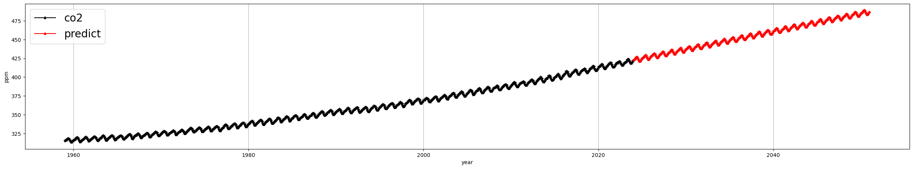

# 🎓 Introduction to Big Data - Term Project

**Topic**: Predicting Seasonal Length Changes Based on CO₂ Concentration

---

## 1. Project Overview

This project analyzes the relationship between CO₂ concentration and seasonal length changes in South Korea and uses that relationship to predict future seasonal lengths. The experiment was conducted in the following steps:

1. **CO₂ Emissions Forecasting**  
   `CO₂_emissions(2024–2050) = LinearRegression(CO₂_emissions(1959–2023))`

2. **CO₂ Concentration Forecasting**  
   `CO₂_ppm(2024–2050) = SARIMAX(CO₂_emissions(2024–2050))`

3. **Future Seasonal Length Prediction**  
   `Season(2024–2050) = SARIMAX(CO₂_ppm(2024–2050))`

---

## 2. Seasonal Length Data Construction

- Seasonal lengths were defined based on meteorological criteria:
  - **Summer**: The first day when the 9-day moving average of daily temperature exceeds 20°C and does not drop below again
  - Similarly:
    - **Spring**: Exceeds 5°C
    - **Autumn**: Drops below 20°C
    - **Winter**: Drops below 5°C

---

## 3. Correlation Between CO₂ and Seasonal Length

- **Spring & Summer**: Positive correlation with CO₂ concentration  
- **Autumn & Winter**: Negative correlation with CO₂ concentration

---

## 4. Future Seasonal Length Prediction

1. **CO₂ concentration prediction (2024–2050)** using the SARIMA model  
   

2. **Seasonal length prediction** using the predicted CO₂ as an exogenous variable in the SARIMAX model  
   

---

## 5. Carbon Neutrality Scenario Modeling

Based on CO₂ emissions data from 23 countries, we created three scenarios:

1. **Carbon Neutral Achieved**: CO₂ emissions reach 0 by 2050 (linear interpolation)
2. **Carbon Neutral Not Achieved**: Emissions predicted using linear regression

### Scenario 1: Carbon Neutral Achieved (16 Countries)  

### Scenario 2: Carbon Neutral Not Achieved  

### Scenario 3: Global Carbon Neutrality Achieved  

---

## 6. CO₂ Forecast by Scenario

Predicted CO₂ concentration for each scenario:  

---

## 7. Seasonal Length Prediction by Scenario

### 7.1 Scenario 1: Carbon Neutral Achieved (16 Countries)  

### 7.2 Scenario 2: Carbon Neutral Not Achieved  

### 7.3 Scenario 3: Global Carbon Neutrality Achieved  

---

## 8. Results & Insights

- **Carbon neutrality** tends to lead to a **recovery of seasonal balance**
- In **Scenario 3**, spring and summer lengths significantly decrease, while autumn shows recovery

---

## 9. Conclusion

- **Global warming** is a **shared challenge** requiring worldwide collaboration
- Without the participation of major CO₂ emitters, carbon neutrality policies will have limited effectiveness
- Broader global cooperation can lead to seasonal recovery and real progress in combating climate change

---

## 10. Data Sources

- **Daily average temperature in South Korea**  
  https://data.kma.go.kr/data/grnd/selectAsosRltmList.do?pgmNo=36&tabNo=1

- **CO₂ concentration**  
  https://www.kaggle.com/datasets/jarredpriester/noaa-monthly-co2-ppm

- **CO₂ emissions**  
  https://ourworldindata.org/co2-and-greenhouse-gas-emissions

---

## 11. Feedback Welcome

This project focuses on understanding the relationship between CO₂ and seasonal length, and predicting future seasonal changes.  
We warmly welcome any **feedback or suggestions** to improve the analysis and presentation of our results.

- Please feel free to share your thoughts or questions.
- We're open to discussion and continuous improvement.

Your valuable insights will greatly contribute to the advancement of this project!
